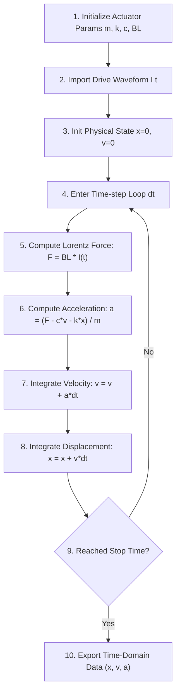

# ⚡ ansv-haptics-sim

> **A Minimal 2nd-Order Harmonic Oscillator Demo for Actuator Physics & Motor 5 Key Parameters.**  
> A lightweight physics simulation tool for Haptic Actuators (LRA / VCM / ERM).

 English | [简体中文](README_CN.md)

---

## 📈 Interactive Simulation Preview

Below is the dynamic simulation generated by `ansv-haptics-sim` showing a full haptic actuator lifecycle (Transient Rise $\rightarrow$ Extended Steady-State $\rightarrow$ Cutoff Ring-down Decay):


---

## 📌 Overview & Developer Note

`ansv-haptics-sim` is a lightweight, open-source 2nd-order harmonic oscillator solver for educational demonstration and haptic actuator physics modeling.

> 🛠️ **Developer Note**:  
> My primary engineering stack for industrial simulation and data acquisition has historically been **LabVIEW**. As an individual developer with limited bandwidth, I am currently learning and exploring **JavaScript** for Web-based physics visualization in my spare time. I will refine and update this open-source repository as time permits. Community contributions and feedback are warmly welcome!  
> 
> 🌐 Feel free to check out my open lab page at [ansv.net/simulations/](https://ansv.net/simulations/) for more simulation demos.

---

## 🔬 Physics Model & Motor 5 Key Parameters

The system dynamics are governed by the 2nd-order linear differential equation:

$$m \cdot \frac{d^2x}{dt^2} + c \cdot \frac{dx}{dt} + k \cdot x = F(t) = BL \cdot I(t)$$

| Parameter | Symbol | Description | Default Value | Unit |
| :--- | :--- | :--- | :--- | :--- |
| **`mass`** | $m$ | Moving Mass | `0.0015` (1.5g) | $\text{kg}$ |
| **`stiffness`** | $k$ | Spring Stiffness | `800` | $\text{N/m}$ |
| **`damping`** | $c$ | Damping Coefficient | `0.10` | $\text{N}\cdot\text{s/m}$ |
| **`bl`** | $BL$ | Force Factor / BL Product | `1.2` | $\text{N/A}$ or $\text{T}\cdot\text{m}$ |
| **`current`** | $I$ | Drive Current Peak | `0.4` | $\text{A}$ (Ampere) |

**Derived Key Metrics:**

- **Resonant Frequency ($f_0$)**:
  $$f_0 = \frac{1}{2\pi}\sqrt{\frac{k}{m}} \quad (\text{Hz})$$

- **Acceleration Response ($a$)**:
  $$a(t) = \frac{d^2x/dt^2}{9.81} \quad (\text{G})$$

---

## 🔄 Core Numerical Solver Architecture

To illustrate the underlying data flow and Euler numerical integration loop of the physics engine, below is the core execution flowchart of `ansv-haptics-sim`:



> **Figure 2**: `ansv-haptics-sim` Numerical Integration Solver Flowchart.

---

## 🚀 Quick Start & Usage

```bash
# Run unit tests
npm test

# Generate SVG simulation graph (Supports English & Chinese CLI output)
npm run build:svg

# Run with custom parameters & English terminal CLI output
node generate_svg.js --lang=en --mass=0.002 --stiffness=950 --bl=1.5 --current=0.5

# Run with Chinese terminal CLI output
node generate_svg.js --lang=zh --mass=0.002 --stiffness=950
```

### JavaScript API Usage

```javascript
const { solveBasicDampedOscillator } = require('./index');

// Define custom motor parameters:
const myMotorParams = {
  mass: 0.0015,       // Mass m = 1.5g (0.0015 kg)
  stiffness: 800,     // Stiffness k = 800 N/m
  damping: 0.10,      // Damping c = 0.10 Ns/m
  bl: 1.2,            // BL = 1.2 N/A
  current: 0.4,       // Current I = 0.4 A
  driveType: 'ac',    // 'ac' for sine wave drive, 'dc' for step drive
  driveDuration: 0.20 // 200ms power-on duration
};

// Solve 260ms simulation (0.1ms step size)
const res = solveBasicDampedOscillator(myMotorParams, 0.260, 0.0001);

console.log(`📌 Resonant Frequency (f0): ${res.f0Hz} Hz`);
console.log(`📈 Steady-State Amplitude: ±${Math.max(...res.displacement.slice(600, 1800))} mm`);
```

---

## 🤝 Links & Personal Tech Channels

* 🌐 **Personal Tech Website**: [https://ansv.net](https://ansv.net)
* 📱 **WeChat Official Account**: **【ANSV微型执行器】**
* 💡 **Zhihu Column**: [Zhihu@ansv-net](https://www.zhihu.com/people/ansv-net)

---

## 📜 License

[MIT License](LICENSE) © 2026 ansv.net
