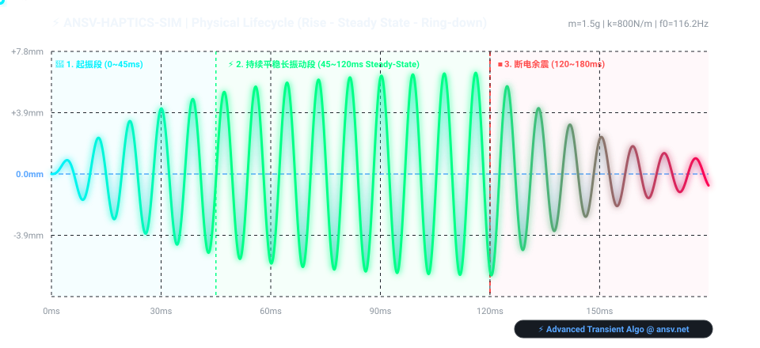

# ⚡ ansv-haptics-sim

> **A Minimal 2nd-Order Harmonic Oscillator Demo for Actuator Physics.**  
> 简易二阶阻尼振荡器基础物理演示模型。

[](https://opensource.org/licenses/MIT)
[](test.js)

---

## 📈 Interactive Simulation Preview 动态模拟效果展示

以下为 `ansv-haptics-sim` 求解获得的触觉马达（LRA）受力阶跃响应与阻尼衰减动画曲线（SVG 动态矢量图形，原生支持暗黑主题）：



---

## 📌 Overview 简介

`ansv-haptics-sim` 是一个用于教学与基础物理演练的简易二阶阻尼振荡器模型，用极简代码演示质量-弹簧-阻尼系统的受力响应。

> 💡 **商业级多物理场仿真 (Commercial Digital Twin)**：  
> 本开源项目仅提供基础二阶微分演练。如需体验完整的非线性刚度 $K(x)$ 建模、热电耦合及多类型马达动态物理仿真，请访问官网：[https://ansv.net/simulations/](https://ansv.net/simulations/)

---

## 🔬 Physics Model 基础方程

$$m \cdot \frac{d^2x}{dt^2} + c \cdot \frac{dx}{dt} + k \cdot x = F(t)$$

---

## 🚀 Quick Start & Usage 使用示例

```bash
# 运行单元测试 (Unit Test)
npm test

# 重新生成 SVG 动态模拟图表
npm run build:svg
```

### JavaScript 调用代码

```javascript
const { solveBasicDampedOscillator } = require('./index');

const result = solveBasicDampedOscillator({
  mass: 0.0015,     // 质量 m (kg)
  stiffness: 800,   // 弹簧刚度 k (N/m)
  damping: 0.03,    // 阻尼系数 c (Ns/m)
  force: 0.5        // 驱动力 F (N)
}, 0.04, 0.0001);   // 仿真时长 40ms, 步长 0.1ms

console.log(result);
```

---

## 🤝 Links & Support 链接与支持

* 🌐 **官网在线仿真实验室**：[https://ansv.net](https://ansv.net)
* 📱 **微信公众号**：**【ANSV微型执行器】**
* 💡 **知乎专栏**：[知乎@ansv-net](https://www.zhihu.com/people/ansv-net)

---

## 📜 License

[MIT License](LICENSE) © 2026 ansv.net
