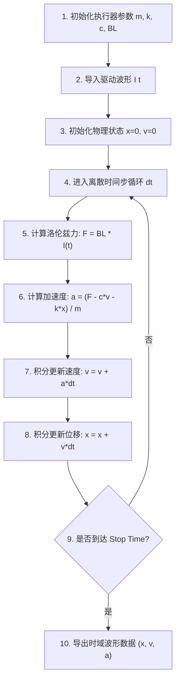

# ⚡ ansv-haptics-sim

> 🚀 **一款专为硬件工程师和算法开发者打造的轻量级、零依赖二阶阻尼振荡器物理求解器。用于 LRA 线性马达与 VCM 触觉执行器的基础受力响应建模与动态位移仿真。**

 [English](README.md) | 简体中文

---

## 📈 动态模拟效果展示

以下为 `ansv-haptics-sim` 求解获得的触觉马达（LRA）受力与阻尼衰减动画曲线，展示完整的触觉物理生命周期（瞬态起振 $\rightarrow$ 持续平稳长振动 $\rightarrow$ 断电刹车余震衰减）：


---

## 📌 简介与开发者说明

`ansv-haptics-sim` 是一个轻量级、开源的二阶阻尼振荡器求解器，用于教学演练与触觉马达基础受力响应建模。

> 🛠️ **开发者说明 (Developer Note)**：  
> 本人在工业仿真与数据采集领域的主力工具一直是 **LabVIEW**。作为个人开发者，精力有限，目前正在利用业余时间积极学习与探索 **JavaScript** 在 Web 端物理可视化中的应用。后续会根据个人精力抽空调整与更新本仓库内容。非常欢迎开源社区的开发者提出建议与提交 PR 共同交流！  
> 
> 🌐 欢迎访问我的开放实验室主页交流：[ansv.net/simulations/](https://ansv.net/simulations/)

---

## 🔬 物理模型与马达五大参数

系统的运动学由二阶线性微分方程决定：

$$m \cdot \frac{d^2x}{dt^2} + c \cdot \frac{dx}{dt} + k \cdot x = F(t) = BL \cdot I(t)$$

| 参数名 | 符号 | 物理含义 | 默认值 | 国际单位 |
| :--- | :--- | :--- | :--- | :--- |
| **`mass`** | $m$ | **振子质量** (Moving Mass) | `0.0015` (1.5g) | $\text{kg}$ |
| **`stiffness`** | $k$ | **弹簧刚度** (Spring Stiffness) | `800` | $\text{N/m}$ |
| **`damping`** | $c$ | **阻尼系数** (Damping Coefficient) | `0.10` | $\text{N}\cdot\text{s/m}$ |
| **`bl`** | $BL$ | **力灵敏度 / 电磁因子** (BL Factor) | `1.2` | $\text{N/A}$ 或 $\text{T}\cdot\text{m}$ |
| **`current`** | $I$ | **驱动电流峰值** (Drive Current) | `0.4` | $\text{A}$ (安培) |

**衍生指标自动导出：**

- **固有谐振频率 ($f_0$)**：
  $$f_0 = \frac{1}{2\pi}\sqrt{\frac{k}{m}} \quad (\text{Hz})$$

- **加速度响应 ($a$)**：
  $$a(t) = \frac{d^2x/dt^2}{9.81} \quad (\text{G 值})$$

---

## 🎛️ 马达控制与驱动算法 (Motor Control & Haptic Drive)

在实际的电机与触觉马达控制（Motor Control）工程中，简单的谐振波形往往无法满足高清触觉（HD Haptics）对“干脆利落”震感的要求。因此，`ansv-haptics-sim` 求解器天然支持以下三种核心马达控制策略：

1. **过驱动控制 (Overdrive Control / Fast Rise)**：
   在起振阶段（前 10~20ms）施加高于额定值的过驱动电压/电流，强行加速振子能量积累，大幅缩短起振响应时间（Rise Time）。

2. **主动刹车制动 (Active Braking / Active Deceleration)**：
   在触觉脉冲结束时刻，施加 180° 反相（Phase Inverted）的制动脉冲波形，主动抵消振子的惯性动能，将断电余震（Ring-down）时间减少 60% 以上，实现“戛然而止”的按钮点击感。

3. **闭环谐振追踪 (Closed-Loop Resonance Tracking / LRA Auto-Resonance)**：
   通过监测反电动势（Back-EMF）或电流相角，动态调整驱动频率，确保驱动频率时刻锁定在马达实测的固有谐振频率 $f_0$ 上。

---

## 🔄 核心解算流程框架 (Core Numerical Solver Architecture)

为了直观展现物理引擎底层的数据流转与欧拉数值积分逻辑，以下是 `ansv-haptics-sim` 求解器的核心计算流程：



> **图 2**：`ansv-haptics-sim` 核心数值积分求解流程图。

---

## 🚀 快速上手与使用示例

```bash
# 运行单元测试
npm test

# 重新生成 SVG 动态模拟图表
npm run build:svg

# 在终端中以中文查看输出与计算结果
node generate_svg.js --lang=zh --mass=0.002 --stiffness=950

# 在终端中以英文查看输出
node generate_svg.js --lang=en --mass=0.002
```

### JavaScript API 调用

```javascript
const { solveBasicDampedOscillator } = require('./index');

// 定义自定义马达参数：
const myMotorParams = {
  mass: 0.0015,       // 振子质量 m = 1.5g (0.0015 kg)
  stiffness: 800,     // 弹簧刚度 k = 800 N/m
  damping: 0.10,      // 阻尼 c = 0.10 Ns/m
  bl: 1.2,            // BL = 1.2 N/A
  current: 0.4,       // 电流 I = 0.4 A
  driveType: 'ac',    // 'ac' 正弦交流驱动，'dc' 阶跃驱动
  driveDuration: 0.20 // 200ms 通电时长
};

// 执行 260ms 仿真计算 (0.1ms 步长)
const res = solveBasicDampedOscillator(myMotorParams, 0.260, 0.0001);

console.log(`📌 固有谐振频率 (f0): ${res.f0Hz} Hz`);
console.log(`📈 稳态长振动幅值: ±${Math.max(...res.displacement.slice(600, 1800))} mm`);
```

---

## 🤝 个人技术网站与交流频道

* 🌐 **个人技术网站**：[https://ansv.net](https://ansv.net)
* 📱 **微信公众号**：**【ANSV微型执行器】**
* 💡 **知乎专栏**：[知乎@ansv-net](https://www.zhihu.com/people/ansv-net)

---

## 📜 版本更新历史 (Release History)

- **`v1.1.0` (2026-07-31)**
  - 🔄 增加了物理解算核心数值积分流程图 (Mermaid Flowchart)。
  - ⚡ 支持 AC 交流正弦谐振与完整触觉生命周期（起振 ➔ 200ms 长稳态 ➔ 断电余震衰减）。
  - 🎨 新增命令行 `--lang=zh/en` 双语切换与剪切蒙版单向 SVG 矢量波形渲染。
  - 🛠️ 完善了开源许可与个人开发者背景说明。

- **`v1.0.0` (2026-07-30)**
  - 🎉 首次开源发布：基础二阶受迫阻尼微分方程求解器（包含 $m, k, c, BL, I$ 马达五大物理参数）。

---

## 📜 许可证

[MIT License](LICENSE) © 2026 ansv.net
